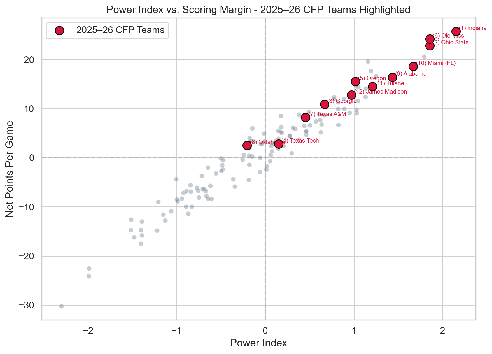
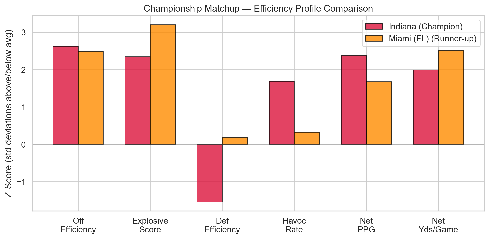

# Building a Composite Power Index for College Football

**Can efficiency metrics predict CFB Playoff teams better than raw rankings?**

**Season:** 2025 FBS · 136 teams · 2025–26 College Football Playoff (12-team format)

---

## Overview

Traditional college football rankings rely heavily on win-loss records and subjective voter polls. This project takes a different approach — constructing a **composite Power Index** from six engineered efficiency metrics to rank every FBS team based on how they actually performed on both sides of the ball.

We then validate the index against the **2025–26 College Football Playoff** — a season that featured Indiana's undefeated championship run, five SEC teams earning bids, and the controversial exclusion of Notre Dame in favor of conference champions Tulane and James Madison.

---

## Results

### Power Index Rankings

The index produces a near-normal distribution centered at zero, with elite teams clearly separating from the pack. Indiana, the eventual national champion, sits at #1 with significant separation from the field.


### Validation Against the Actual CFP

We compared our top 12 against the committee's 12 selections. The index correctly identified the national champion, flagged Notre Dame's exclusion as a potential committee miss, and captured most of the field, while naturally struggling with automatic bids given to Group of 5 conference champions.



### Championship Retrospective — Indiana vs. Miami (FL)

A side-by-side efficiency profile of the national champion and runner-up. Indiana held advantages across multiple dimensions, which the index captured before the playoff even began.



### Win Probability Model

Using the Power Index as input, a logistic win probability model estimates head-to-head outcomes at neutral sites. The model was retroactively tested against all 11 actual CFP bracket games.


---

## Engineered Metrics

Raw totals are misleading — teams play 12 to 16 games depending on postseason. We derive six per-play and net efficiency metrics that normalize for opportunity:

| Metric | Formula | What It Captures |
|---|---|---|
| Offensive Efficiency | PPG ÷ Plays/Game | Points generated per snap |
| Explosive Score | Yds/Play × Off Efficiency | Big-play capability |
| Defensive Efficiency | PPG Allowed ÷ Plays Faced | Points surrendered per snap |
| Defensive Havoc Rate | Takeaways ÷ Plays Faced | Turnover creation rate |
| Net PPG | Off PPG − Def PPG Allowed | Scoring margin |
| Net Yards/Game | Off Yds − Def Yds Allowed | Yardage margin |

Each metric is standardized to z-scores, then combined with domain-informed weights into a single composite score.

---

## Key Findings

- **The index identified the national champion.** Indiana ranked #1 in our Power Index before the playoff began.
- **Notre Dame was the #4 team by efficiency** despite being left out of the CFP, supporting the argument that their exclusion was controversial.
- **Efficiency-based ranking outperforms raw offensive rank** at identifying playoff-caliber teams.
- **Natural blind spot for automatic bids.** Group of 5 champions (Tulane, James Madison) earn spots through conference rules, not necessarily through the kind of efficiency this index measures.
- **The win probability model** correctly predicted the outcome of multiple CFP bracket games retroactively.

---

## Notebook Structure

The analysis follows a linear narrative:

1. **Setup & Data Loading**
2. **Data Quality Check**
3. **Exploratory Data Analysis**: scoring distributions, offense vs. defense quadrants, third-down efficiency, feature correlations
4. **Feature Engineering**: six per-play/net metrics with rationale
5. **Power Index Construction**: z-score standardization + weighted aggregation
6. **Validation**: index vs. actual CFP selections, championship retrospective
7. **Win Probability Model**: logistic model + retroactive bracket predictions
8. **Team Profile Tool**: reusable function to profile any FBS team
9. **Limitations & Future Work**
10. **Conclusion**

---

## Tech Stack

- Python 3.11+
- pandas, numpy, scikit-learn, seaborn, matplotlib

---

## How to Run

```bash
git clone https://github.com/yourusername/cfb-power-index.git
cd cfb-power-index
pip install -r requirements.txt
jupyter notebook CFB_Power_Index_Study.ipynb
```

---

## Future Work

- **Learn weights from data** — logistic regression on historical playoff outcomes across multiple seasons
- **Strength of schedule adjustment** — especially important for fairly evaluating G5 teams
- **Multi-year validation** — train on 2024 season, test on 2025
- **Play-by-play EPA integration** — Expected Points Added for deeper efficiency measurement
- **Two-stage model** — predict conference champions first, then rank the at-large field

---
